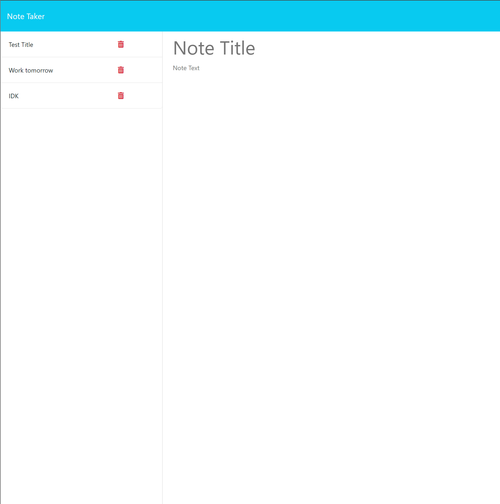

# 11-Keyes-Challenge

## Description

This is a note taker where the user can create notes and delete notes. It is organized by creation date and if you exit out of the site and reload it the notes will persist.


## Table of Contents

- [Installation](#installation)
- [Usage](#usage)
- [Contributing](#contributing)
- [Tests](#tests)
- [Questions](#questions)
- [License](#license)

## Installation

```
Run an npm install
```

## Usage

It is used by starting up the server and going to your local host. Ideally it should just be a URL that the user goes too, but I was not able to get the site deployed.

## Contributing

They can figure out how to deploy my site

## Tests

```
There is a test script that can be run as the user can see in the package.json.
```

## Questions

If you have any questions about the repo, open an issue or contact me directly at willkeyes01@gmail.com. You can find more of my work at [https://github.com/WillKeyes](https://github.com/https://github.com/WillKeyes).

## License

This project is licensed under the MIT license.
  